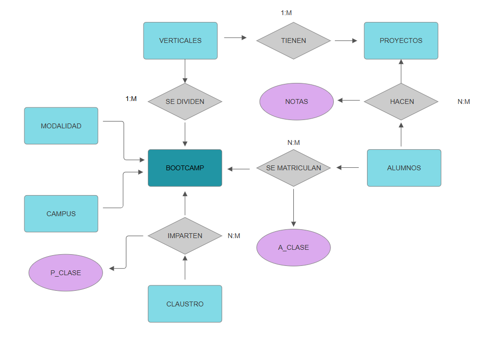

# Creación de BB.DD Académica

Este proyecto tiene como objetivo crear una base de datos enfocada en la gestión de información de estudiantes y profesores de una institución académica especializada en programas de entrenamiento intensivo en diversas áreas tecnológicas. 

El diseño está optimizado para realizar consultas eficientes y garantizar la integridad de los datos. El objetivo ha sido hacer una lógica que genere un modelo lo más escalable posible.

---

## 📂 Estructura de la Base de Datos

La base de datos contiene las siguientes tablas principales:

1. **Alumnos:** contiene los datos de contacto del alumno
2. **Proyectos:** nombre de los proyectos asociados a cada vertical
3. **Verticales:** distintas modalidades impartidas en los campus
4. **Calificaciones:** se dividen en apto y no apto
5. **Modalidad:** se tratan como booleanos y en este caso, como no se especifica en las clases el tipo de modalidad, se supone todo como True
6. **Campus:** en esta tabla vemos la localización de cada campus
7. **Claustro:** contiene todos los datos de los profesores como nombre y rol
8. **Bootcamp:** es el centro de todo el modelo donde se recogen todo los id
9. **A_Clase:** tabla intermedia entre bootcamp y alumnos
10. **P_Clase:** tabla intermedia entre claustro y bootcamp

> 
---

## 🛠️ Herramientas Utilizadas

- **Sistema Gestor de Base de Datos (SGBD):** PostgreSQL
- **Render**
- **Librerías:**  
  - `pandas`  
  - `psycopg2`
  - `sqlalchemy`
     
- **Archivos CSV:** Proporcionados para poblar las tablas con datos iniciales.  
- **Lenguaje de Programación:** Python, utilizado para interactuar con la base de datos y realizar operaciones.

---
## **Autores**
- Ignacio Miguelsanz
- Irene Arrabé
- Yanelis Gonzalez

## ⚙️ Configuración

### 1. Clonar este repositorio
```bash
https://github.com/IreneAP19/DDBB.git


